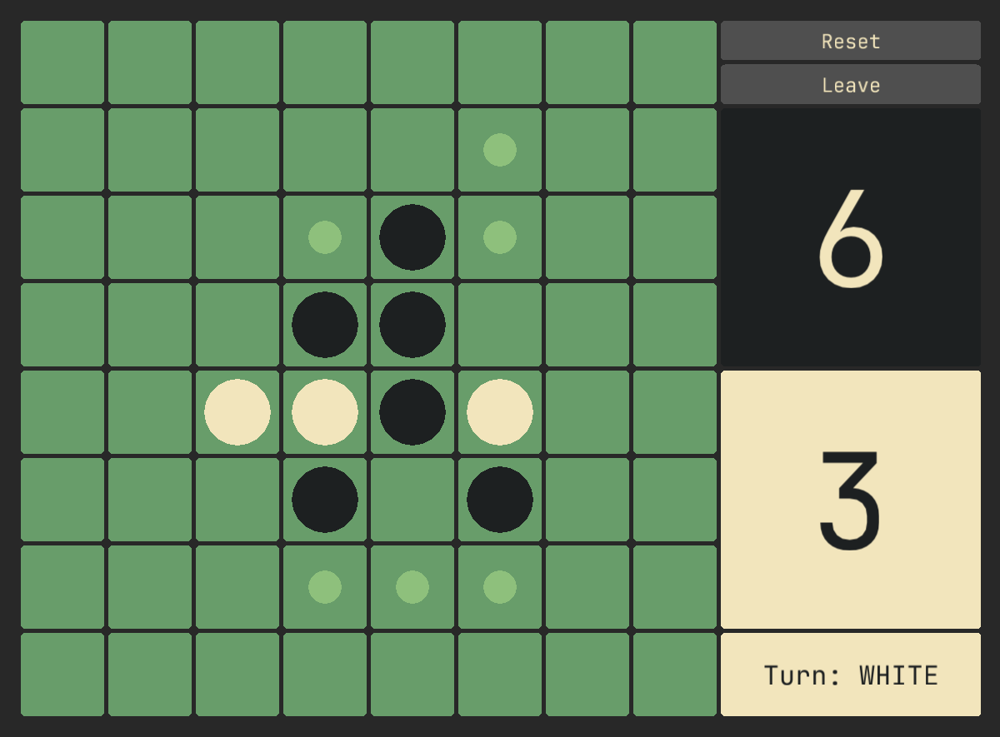

<h1 align="center"> othello-rs </h1>

The game Othello implemented in Rust using macroquad.

## Progress
- [x] Basic board and piece drawing.
- [x] Game Logic and move calculation.
- [x] Ui.
- [x] Win condition checking. ( ignore the broken dummy winner screen :P )
- [ ] Menu screens.

## Images

